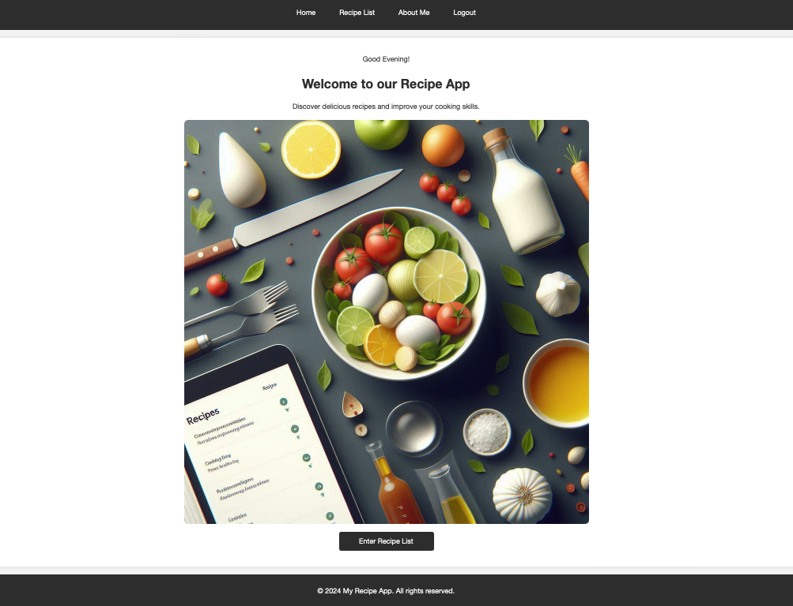
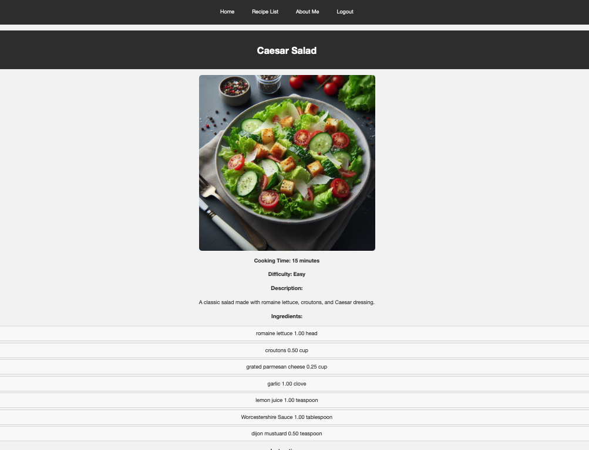

# Recipe Application

Welcome to the Recipe Application! This app allows users to browse, search, and manage a collection of recipes. Users can add new recipes, view details, and edit existing ones.

See Live Site: https://timone019.pythonanywhere.com

## Features

- **Recipe Management**: Create, update, and delete recipes.
  
- **Ingredient Management**: Add ingredients with quantity details.
  
- **Search Functionality**: Easily find recipes by name or ingredient.
  
- **User Authentication**: Secure login and registration for users.
  
- **Responsive Design**: Mobile-friendly interface.
  
## Tech Stack

- **Frontend**:
  - HTML
  - CSS
  - JavaScript

- **Backend**:
  - Python
  - Django

- **Database**:
  - PostgreSQL

- **Deployment**:
  - PythonAnywhere
  - Gunicorn
  - Whitenoise

- **Other Libraries**:
  - Matplotlib
  - Pandas
  - Pillow

## Screenshots




## Installation

To get started with this project, follow these steps:

### Prerequisites

- Python 3.8+
- Django 3.2+
- Git

### Steps

1. **Clone the repository** and navigate to the project directory:
   ```bash
   git clone https://github.com/your-username/recipe-app.git
   cd recipe-app
   ```

2. **Navigate to the src directory** (where the Django project is located):
   ```bash
   cd src
   ```

3. **Set up the virtual environment**:
   ```bash
   python -m venv venv
   source venv/bin/activate  # On Windows use `venv\Scripts\activate`
   ```

4. **Install dependencies** (from the project root directory):
   ```bash
   cd ..  # Go back to the project root
   pip install -r requirements.txt
   cd src  # Return to the src directory for the next steps
   ```

5. **Apply database migrations**:
   ```bash
   python manage.py migrate
   ```

6. **Create a superuser** (admin account):
   ```bash
   python manage.py createsuperuser
   ```

7. **Run the development server**:
   ```bash
   python manage.py runserver
   ```

8. **Access the application**:
   - Main site: http://localhost:8000/
   - Admin panel: http://localhost:8000/admin/

**Note**: The project uses a `src/` directory structure where the Django project lives. Most commands need to be run from within the `src/` directory after activation of the virtual environment.

## Usage
- Browse Recipes: View a list of all recipes.
  
- Search Recipes: Use the search bar to find recipes by name or ingredient.
  
- Add Recipes: Click on "Add Recipe" to create a new recipe.
  
- Edit Recipes: Click on a recipe and select "Edit" to update it.
  
- Delete Recipes: Click on a recipe and select "Delete" to remove it.